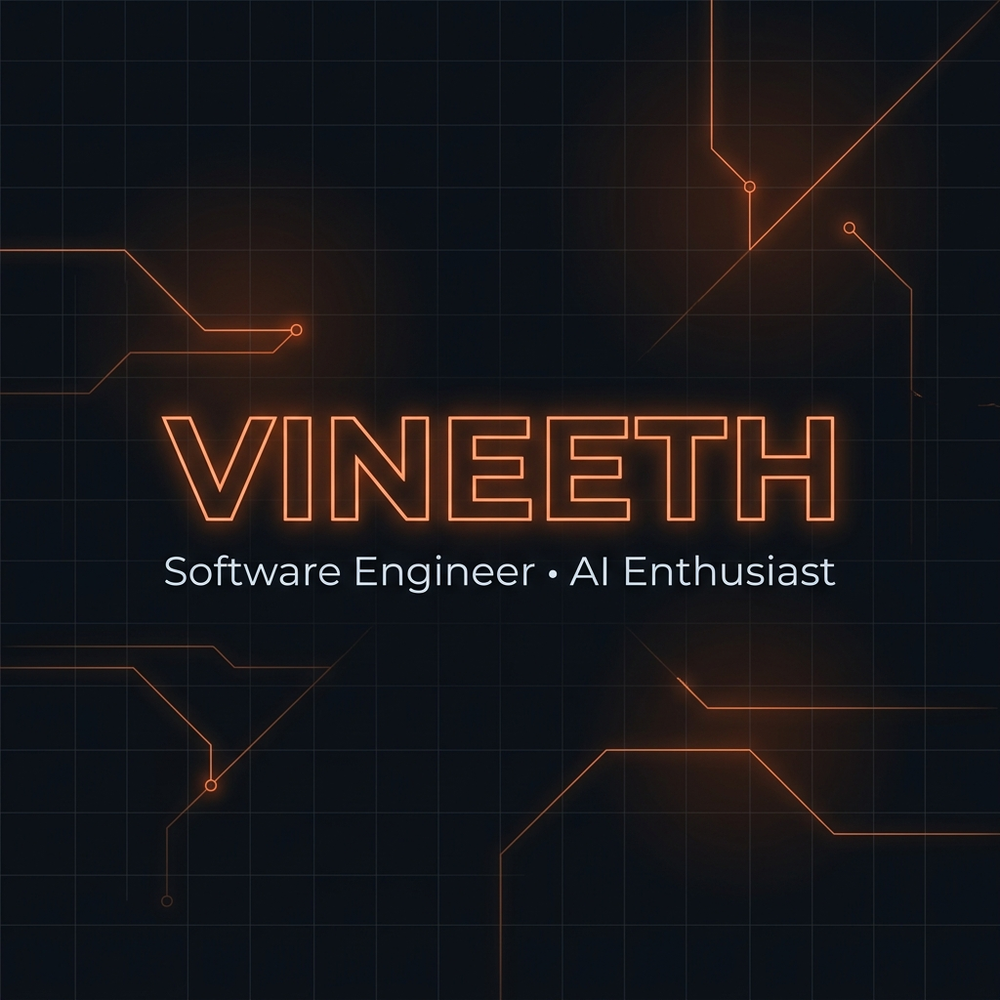

<p align="center">
  
</p>

<p align="center">
  <a href="https://git.io/typing-svg">
    
  </a>
</p>

<p align="center">
  
</p>

## 📌 About Me

```text
🎓 Computer Science Engineering Student

📍 Chennai, India

💡 Passionate about software engineering, backend systems,
   mobile applications and AI.

🚀 Interested in building products that solve real-world problems.
```

<p align="center">
  
</p>

## 🛠️ Tech Stack

### 💻 Languages


### 🎨 Frontend


### ⚙️ Backend


### 🗄️ Database


### 🤖 AI & Computer Vision


### 🧰 Tools & Environment


<p align="center">
  
</p>

## 💼 Experience & Journey

### 🏢 Internship
**AI & Software Development Intern**
> Worked on an AI-powered **Driver Monitoring System** using computer vision and deep learning.

<p align="center">
  
</p>

## 📊 GitHub Analytics

<p align="center">
  
  &nbsp;&nbsp;
  
</p>

<p align="center">
  
</p>

<p align="center">
  
</p>

<p align="center">
  
</p>

## 🏆 Achievements

* 🏆 **Flutter Workshop Speaker**
* 💻 **Built multiple full-stack applications**
* 🤖 **Experience with Computer Vision**
* 📱 **Android Application Development**
* ☁️ **Learning Cloud & DevOps**

<p align="center">
  
</p>

## 🧠 Developer Philosophy

```cpp
while (!success)
{
    learn();
    build();
    improve();
}
```

<p align="center">
  
</p>

## 🌐 Connect With Me

<p align="center">
  <a href="https://github.com/Vineeth-1204" target="_blank">
    
  </a>
  &nbsp;&nbsp;
  <a href="https://www.linkedin.com/in/vineeth-pragasam-a911282b4/" target="_blank">
    
  </a>
  &nbsp;&nbsp;
  <a href="mailto:vineethprakash61@gmail.com">
    
  </a>
</p>
